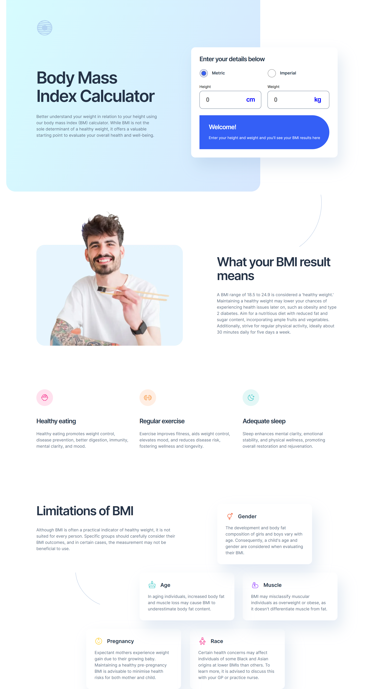

# Frontend Mentor - Body Mass Index Calculator solution

This is a solution to the [Body Mass Index Calculator challenge on Frontend Mentor](https://www.frontendmentor.io/challenges/body-mass-index-calculator-brrBkfSz1T). 

## Table of contents

- [Overview](#overview)
  - [The challenge](#the-challenge)
  - [Screenshot](#screenshot)
  - [Links](#links)
- [My process](#my-process)
  - [Built with](#built-with)
  - [What I learned](#what-i-learned)
  - [Continued development](#continued-development)
  - [Useful resources](#useful-resources)
- [Author](#author)

## Overview

### The challenge

Users should be able to:

- Select whether they want to use metric or imperial units
- Enter their height and weight
- See their BMI result, with their weight classification and healthy weight range
- View the optimal layout for the interface depending on their device's screen size
- See hover and focus states for all interactive elements on the page

### Screenshot

Additional screenshots are available in the ./assets/screenshots directory.

### Links

- Solution URL: [See my solution on GitHub](https://github.com/jguleserian/FMC-BMI-Calculator.git)
- Live Site URL: [Click here to see the site live](https://jguleserian.github.io/FMC-BMI-Calculator/)

## My process
**Workflow:**

1. Set up folders and file structure
2. Determine strategy for structuring the page
3. HTML: set major structure with containers, placing the general content within them
4. HTML: starting from the top with each major container, assign content to individual elements and arrange them as necessary.
5. HTML: link and place <picture> and  / <source> files as necessary. Set media query sizes as necessary.
6. CSS: set up.
  - "Pencil in" the major structure using GPS: "reset & variables," "containers," "elements," "classes & ids," "media queries"
  - Write the CSS for the page reset in the ":root," <html>, <body>, and *. I generally put in the variable for colors, font, etc. at this time.
  - Set the media queries, adding in a change of background color so I can visually identify what query I am viewing and to have an element in the query as a placeholder
  - FIRST GIT COMMIT is generally done here
7. Starting from top to bottom in the HTML, set the CSS styles. 
8. Style/add hover states and animation as necessary
9. Clean up code
10. Test functionality, responsiveness, and similitud with original model in Figma/style guide
11. Upload and publish

### Built with

- Semantic HTML5 markup
- CSS custom properties
- CSS variables
- Flexbox
- Grid
- Mobile-first workflow
- (Vanilla) JavaScript

### What I learned

This project was a real challenge for a couple of reasons. First, the on-the-fly changes and formatting of the form mandated multiple layers of containers that became cumbersome to work with. Second, the JavaScript seemed rather long in light of performing such an easy calculation. The reason for the lengthy script.js, however, was the result of needing so many variables: one set for imperial and one set for metric. Additionally, since there was no "submit" button for the form, every field had to have an eventlistener to force the uptake of the data regardless of the order it is entered by the user.

What I gleaned from the experience:
1. I have some idea of weaknesses (see below) that need to be investigated further.
2. I need to rething my naming of ids and classes so that they are easier to follow. The multiple layers of containers made this more difficult because, for instance, in a section about "tips", there are articles that separate the "tips" and the "tip title" has to be separated from the "tip text" and those have to fit into a "tip structure" of some sort.
3. I reviewed the use of grids and how to use them even when the structural elements do not seem to be aligned in perfect rows and columns.
4. I learned that styling radio buttons is a much more involved process than simply changing th formatting. 
5. I created a more systematic method for adjusting layout for the screen sizes in between the ones required for the project.

### Continued development

This project was certainly helpful in indentifying some weaknesses. Here are a few examples:
1. Formatting and recreating radio buttons. The tutorials I found were not all that helpful.
2. How to work around using ::after and ::before with tags that are self-closing, such as `<input>`. I resorted to using an empty `<label>` tag and adding the `::after` pesudo element to it. But of course, this made the placement of the element very difficult.
3. I want to develop my knowledge on flexbox and grid so I can manipulate positioning, scale, etc. with greater accuracy. 

### Useful resources

- [GPS for CSS Organization](https://github.com/jescalan/gps) - This is the guide I have been using to organize my CSS. It is much more succinct than other methods, accommodates large projects and collaboration and is logically formed, and so logical to read.

## Author

- GitHub - [@jguleserian](https://github.com/jguleserian)
- Frontend Mentor - [@yourusername](https://www.frontendmentor.io/profile/jguleserian)
- LinkedIn - [@yourusername](https://www.linkedin.com/jeffguleserian)

